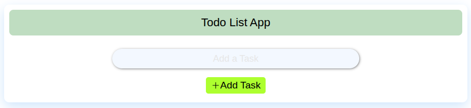
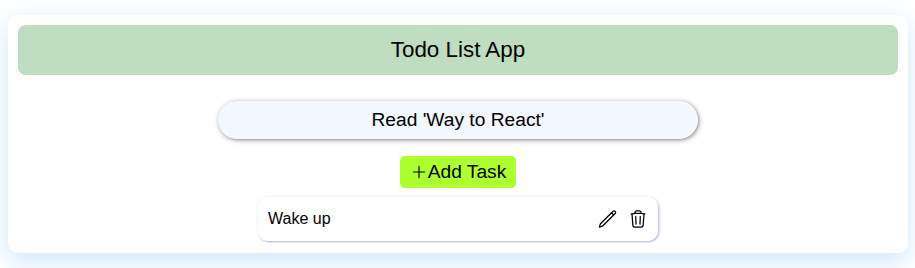
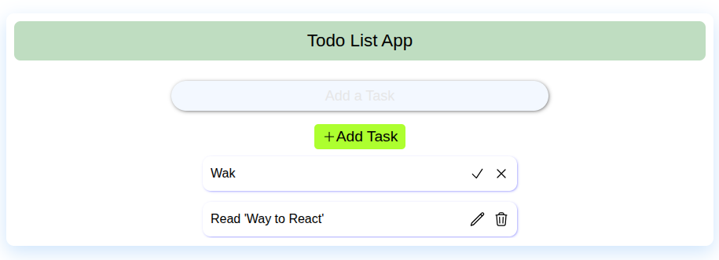
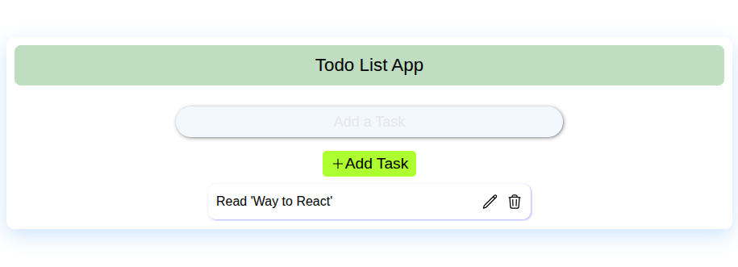

# Todo List App


A simple Todo List app built with **React** and **TypeScript**.  
Users can add, edit, and delete tasks.

## Features

### Add Todo
Users can add a new task using the input field.


### Edit Todo
Edit existing tasks inline with Save and Cancel buttons.


### Delete Todo
Remove tasks easily by clicking the delete button.



## Getting Started

### Prerequisites
- Node.js and npm installed

### Installation
```bash
git clone https://github.com/kibalamaa/React-Todo.git
cd React-Todo
npm install
npm run dev
